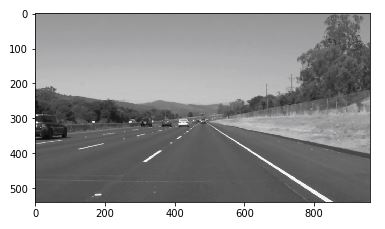
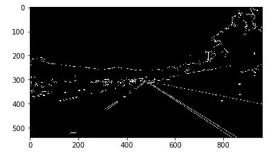
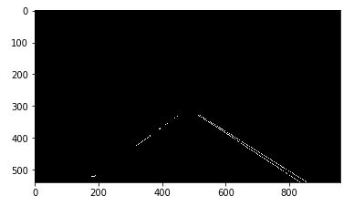
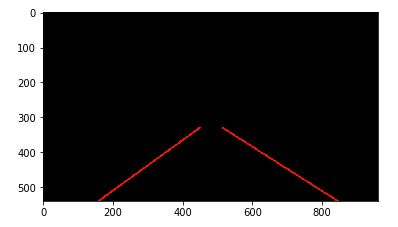
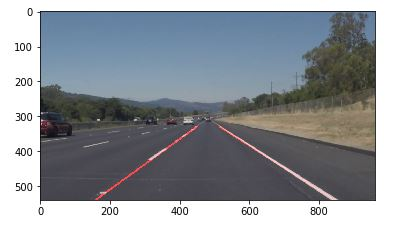

# **Finding Lane Lines on the Road** 

## Overview

When we drive, we use our eyes to decide where to go.  The lines on the road that show us where the lanes are act as our constant reference for where to steer the vehicle.  Naturally, one of the first things we would like to do in developing a self-driving car is to automatically detect lane lines using an algorithm.

In this project you will detect lane lines in images using Python and OpenCV.  OpenCV means "Open-Source Computer Vision", which is a package that has many useful tools for analyzing images.  

To complete the project, two files will be submitted: a file containing project code and a file containing a brief write up explaining your solution. We have included template files to be used both for the [code](https://github.com/udacity/CarND-LaneLines-P1/blob/master/P1.ipynb) and the [writeup](https://github.com/udacity/CarND-LaneLines-P1/blob/master/writeup_template.md).The code file is called P1.ipynb and the writeup template is writeup_template.md 

To meet specifications in the project, take a look at the requirements in the [project rubric](https://review.udacity.com/#!/rubrics/322/view)

## Required Files Overview

[images_outputf folder](images_output/): required images for represent image transfer processes

[test_videos_output folder](test_videos_output/): required videos output with calculated detected road lanes

check out at youtube [solidWhiteRight](https://www.youtube.com/watch?v=emRGHFijMzM)

check out at youtube [solidYellowLeft](https://www.youtube.com/watch?v=kH-5sEtoxN4)

## Land Lane Pipeline

For this project, a great writeup should provide a detailed response to the "Reflection" section of the [project rubric](https://review.udacity.com/#!/rubrics/322/view). There are three parts to the reflection:

#### _Describe the pipeline_

  Build the pipeline and run your solution on all test_images. Make copies into the `test_images_output` directory, and you can use the   images in your writeup report.
  Try tuning the various parameters, especially the low and high Canny thresholds as well as the Hough lines parameters.
  
  using the following cv2 functions to create functions:
  
  `cv2.inRange()` for color selection  
  
  `cv2.fillPoly()` for regions selection  
  
  `cv2.line()` to draw lines on an image given endpoints  
  
  `cv2.addWeighted()` to coadd / overlay two images
  
  `cv2.cvtColor()` to grayscale or change color
  
  `cv2.imwrite()` to output images to file  
  
  `cv2.bitwise_and()` to apply a mask to an image

#### _Image Transfer Process_

Belows are the images process as an example:

Fist of all change the RGB format to gray format

  
then using the canny funciton via different threshold

then using regional area to filter out useless information

using hough_line funciton to draw lines on edge

at last combine line with original image together

## Reflection

#### _Current Algo_

Basically the algo can handle normal road condition without road surface change too much, such as road materal changing, scratches or road trees aside, in most case, the current algo isn't prefect and can't use on real road driving because of the complicated road condition we have.
 
#### _Identify any shortcomings_

  The shortcomings are not from first vedio but from challenge vedios, because there are two many shadow and road lane changing in the vedio, which makes the color filter hard to define the real road lane

#### _Suggest possible improvements_

  it may need to involve some more filters to identify the complicated road conditions

